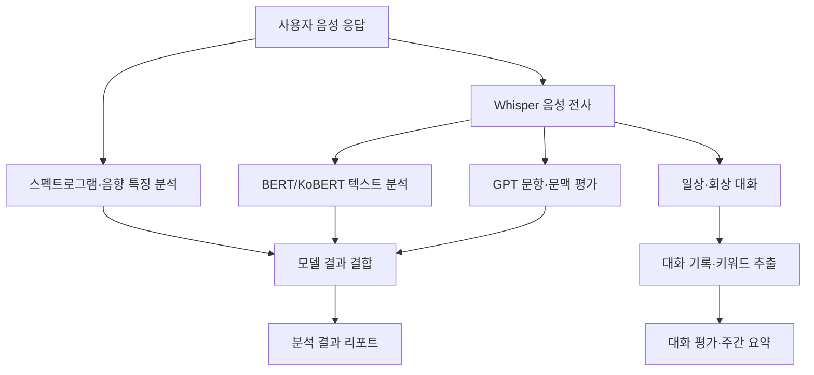

# MINDI

### 음성·텍스트 분석과 회상 대화를 결합한 인지 케어 플랫폼

어르신이 음성으로 질문에 답하고 대화에 참여하면, 음향·언어 특징을 분석하고 결과 리포트를 제공하는 프로젝트입니다. 분석 기능과 일상·회상 대화 기능을 함께 구성했습니다.

2025년 세종대학교 캡스톤디자인에서 개발한 **학습·연구용 프로토타입**입니다. 모델 점수는 프로젝트 내부의 실험 지표입니다.

| 항목 | 내용 |
| --- | --- |
| 개발 시기 | 2025년 1학기 |
| 개발 형태 | 3인 팀 프로젝트 |
| 담당 역할 | AI 개발, 모델 결합 및 파이프라인 통합 |
| 주요 기술 | Python, PyTorch, Transformers, Whisper, BERT/KoBERT, OpenAI API |

## 내가 맡은 작업

### 직접 개발

- **음성 전사·전처리**: Whisper 기반 STT, 음성 응답의 텍스트 변환, 발화 텍스트 정제
- **텍스트 분석**: BERT/KoBERT 기반 분류, GPT 기반 질문·응답 의미 평가와 대화 문맥 연결성 평가
- **회상 대화**: 일상·회상 질문 프롬프트, 주제 선택, 대화 로그 저장과 핵심 키워드 추출
- **모델 결합·리포트**: 문항·텍스트·음향 분석 결과를 연결하는 점수 흐름, 대화 평가와 주간 요약 리포트

### 협업·통합

음향 모델 담당 팀원과 설계 방향 및 개선점을 검토하고 피드백을 제공했습니다. 음향 모델 결과를 텍스트 모델·문항 평가와 연결하는 전체 AI 파이프라인 통합을 주도했습니다.

## 주요 기능

| 기능 | 구현 내용 |
| --- | --- |
| 음성 전사 | 음성을 텍스트로 변환하여 모델 입력으로 사용 |
| 문항 응답 평가 | 질문·기준 답변·사용자 응답을 GPT에 전달하여 의미 일치 여부 평가 |
| 언어 특징 분석 | BERT/KoBERT 분류 결과와 질문·응답의 문맥 연결성을 함께 활용 |
| 음향 특징 분석 | Mel 스펙트로그램과 음향 수치 특징을 분석하는 모델 결과 결합 |
| 일상·회상 대화 | 이전 대화 기록을 활용한 회상 질문과 주제별 일상 질문 생성 |
| 기록·키워드 추출 | 날짜별 대화 기록 저장과 핵심 키워드 추출 모듈 |
| 리포트 | 회상 충실도, 언어 유창성, 맥락 일관성, 정서 반응, 문장 구성력 평가 및 주간 요약 |

## AI 처리 구조

아래 그림은 분석 기능과 케어 기능의 주요 모듈을 요약합니다.

## 기술과 모듈

| 영역 | 기술 / 접근 방식 |
| --- | --- |
| 음성 전사 | Whisper, PyTorch, Transformers, librosa, torchaudio |
| 텍스트 분석 | BERT/KoBERT, 문장 분류, GPT 기반 의미·문맥 평가 |
| 음향 분석 | ViT, Mel 스펙트로그램, MFCC, pitch, jitter, shimmer, HNR |
| 영어 음향 모델 | ViT와 LightGBM 결과 결합 |
| 한국어 음향 확장 | ViT와 PyTorch 기반 음향 특징 분류기 조합 |
| 데이터 처리 | pandas, NumPy, scikit-learn |
| 대화·리포트 | OpenAI API, 날짜별 대화 기록, 프롬프트 기반 평가·요약 |

한국어 음향 모듈의 `lgbm_model.py`는 파일명과 달리 PyTorch 신경망 분류기입니다. 영어 음향 모듈의 LightGBM과 구분합니다.

## 개발 과정에서의 선택

### 데이터 확보 일정에 맞춘 실험 전환

초기에는 한국어 데이터를 활용하려 했으나, 자료 제공 일정에 맞춰 영어 데이터 기반 실험을 먼저 진행했습니다. 이후 한국어 모델 확장 코드를 별도로 구성했습니다.

### 분류 결과와 질문의 문맥을 함께 활용

텍스트 분류 결과만 사용하는 대신, GPT로 질문과 응답의 의미 일치 여부와 문맥 연결성을 평가하는 흐름을 추가했습니다. 문항 응답 평가와 자유 발화 분석을 구분하여 처리했습니다.

### 개별 모델을 하나의 결과 흐름으로 연결

음향 모델, 텍스트 모델, 문항 평가의 출력을 프로젝트 내부 점수 체계에 연결했습니다. 대화 케어 영역에서는 기록을 바탕으로 회상 질문을 만들고 평가 결과를 주간 요약으로 정리했습니다.

## 코드 구성

| 위치 | 내용 |
| --- | --- |
| [model.py](model.py) | 영어 분석 모델 결합 실험 |
| [ko_model.py](ko_model.py) | 한국어 분석 모델 결합 실험 |
| [data_make_csv.py](data_make_csv.py), [ko_data_make_csv.py](ko_data_make_csv.py), [wav_text.py](wav_text.py) | 음성 전사 및 전사 데이터 구성 |
| [addresso_data_cha_to_csv.py](addresso_data_cha_to_csv.py) | 전사 파일에서 대상 발화 추출·정제 |
| [language_model](language_model/) | 영어 BERT 추론과 GPT 응답 평가 |
| [ko_language_model](ko_language_model/) | 한국어 KoBERT 추론과 GPT 응답 평가 |
| [acoustic_model](acoustic_model/) | 영어 ViT·LightGBM 음향 분석 |
| [ko_acoustic_model](ko_acoustic_model/) | 한국어 음향 확장 실험 |
| [care_model](care_model/) | 일상·회상 대화, 기록, 키워드 추출 |
| [report](report/) | 대화 평가와 리포트 생성 |

## 공개 코드와 실행 상태

개발 당시의 Python 실험 코드를 정리한 저장소입니다. 원본 음성·전사·사용자 정보·대화 로그·모델 가중치는 포함하지 않습니다. 코드에 직접 기록되어 있던 API 키는 `OPENAI_API_KEY` 환경 변수로 교체했습니다.

현재 공개본은 Python 문법 검사를 거쳤으며, 모델 추론과 외부 API를 포함한 전체 실행은 재검증 전입니다. 실행 환경과 모듈 연결에서 정리할 사항은 [실험 재현 메모](docs/REPRODUCIBILITY.md)에 기록했습니다.

영어 평가 버전과 한국어 확장 실험을 구분해 보관합니다. 발표 시점의 성능 수치는 평가 조건과 현재 코드의 대응 관계를 확인한 뒤 추가할 예정입니다.
